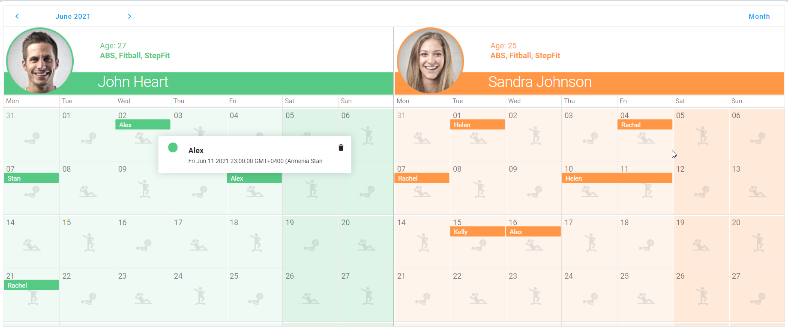

<!-- default badges list -->

<!-- default badges end -->
# Scheduler for DevExtreme - How to implement the appointment layout with the appointment template

This example demonstrates how to implement the appointment layout with the appointment template. You can use the example to customize our default appointment appearance. For example, you can add a new button, change delete button functionality, etc.

## Files to Review

- **jQuery**
    - [index.js](jQuery/src/index.js)
- **Angular**
    - [app.component.html](Angular/src/app/app.component.html)
    - [app.component.ts](Angular/src/app/app.component.ts)
    - [tooltip.component.html](Angular/src/app/tooltip/tooltip.component.html)
    - [tooltip.component.ts](Angular/src/app/tooltip/tooltip.component.ts)
- **Vue**
    - [App.vue](Vue/src/App.vue)
    - [TooltipTemplate.vue](Vue/src/TooltipTemplate.vue)
- **React**
    - [App.tsx](React/src/App.tsx)
    - [Tooltip.tsx](React/src/Tooltip.tsx)

## Documentation

- [appointmentTooltipTemplate](https://js.devexpress.com/Documentation/ApiReference/UI_Components/dxScheduler/Configuration/#appointmentTooltipTemplate)
- [appointmentTooltipRender](https://js.devexpress.com/Documentation/ApiReference/UI_Components/dxScheduler/Configuration/#appointmentTooltipRender)
- [Customize Appointment Tooltip](https://js.devexpress.com/Documentation/Guide/UI_Components/Scheduler/Appointments/Customize_Appointment_Tooltip/)
<!-- feedback -->
## Does this example address your development requirements/objectives?

 

(you will be redirected to DevExpress.com to submit your response)
<!-- feedback end -->
